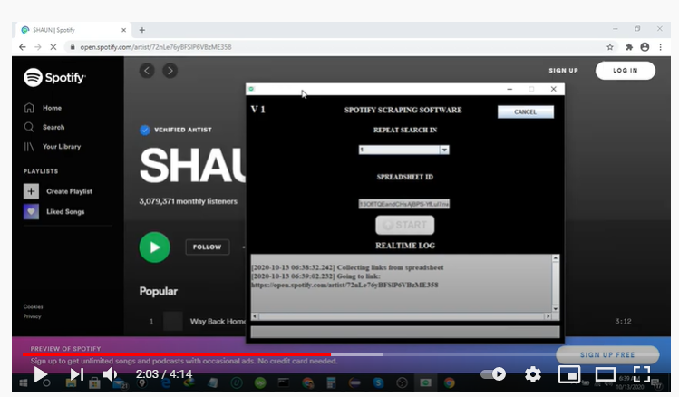

# Spotify-Automation

### User story/ User requirements:

Given a list of Spotify artist’s profile URLs, the automation tool needs to find out their social media accounts, monthly listeners, Total followers.

### Steps to automate:

* Get Spotify artist links form google sheet.
* Collect Spotify followers, monthly listeners from the link.
* Check if the artist has any social media links in the link.
* Visit the artist’s social media & collect personal information.
* Save all the collected information into the google spreadsheet.
* Continue until all the artist’s link has been scraped.

### Final result :
#### Click the image below to watch tutorial video

